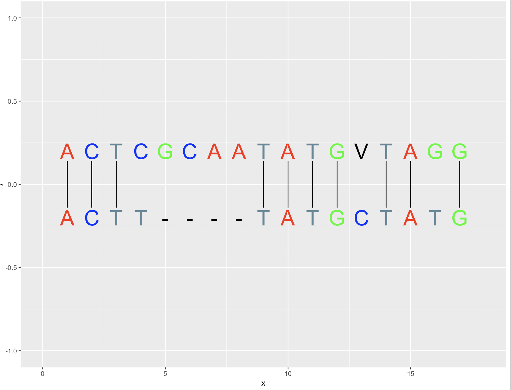

# Sequence Alignment Visualization

## Description
This package enhances the sequence alignment workflow of 
Biostrings package by providing alignment visualization using ggplot.

## Dependency

- Biostrings https://bioconductor.org/packages/release/bioc/html/Biostrings.html
- ggplot2 https://cran.r-project.org/web/packages/ggplot2/index.html


## Installation

```R
library(devtools)
install_github("hannzhang/align")
```

## Example
```{R}
library(align)
align("ACTCGCAATATGVTAGGVVAG", "ACTTTATGCTATGCGC")
```

This will produce the following plot.



